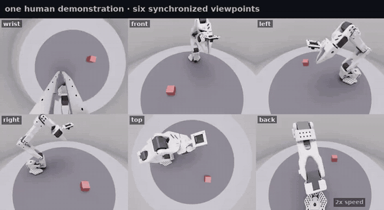

# so101-camera-multiview-bench

**Find out which camera viewpoints a robot policy actually needs, without rebuilding
the camera rig for every experiment.**



Teleoperate a pick-and-place task once. The recorded motion is re-rendered from as many
viewpoints as you like, so every policy you compare learns from the same demonstrations
and differs in one thing only: what it was allowed to see. On real hardware that
comparison is confounded, because each camera setup needs its own recording session and
therefore its own human executions.

Simulation only, built on NVIDIA Isaac Lab and the low-cost
[SO-ARM101](https://github.com/TheRobotStudio/SO-ARM100). No robot required.

- **Documentation:** https://ille-s.github.io/so101-camera-multiview-bench/
- **Dataset:** [ill337/so101-bin-lift-6cam-cylroom](https://huggingface.co/datasets/ill337/so101-bin-lift-6cam-cylroom)
  on the Hugging Face Hub: 540 demonstrations, six viewpoints, LeRobot v3

> Not affiliated with NVIDIA, Hugging Face, or TheRobotStudio.

## What it does

Five stages. Each one writes what the next one reads.

| Stage | Module | Produces |
|---|---|---|
| 1 Recording | `recording.teleop_recorder` | LeRobot dataset + per-episode scene state + bin map |
| 2a Extraction | `recording.trajectory_extractor` | joint trajectories as `.npy` |
| 2b Replay | `recording.multicam_replay` | the same episodes re-rendered from N cameras |
| 2c Fusion | `assembly.bin_fusion` | one trainer-ready dataset from several bins |
| 3 Training | `training.train_act_camera_perm` | an ACT policy over a chosen camera subset |
| 4 Evaluation | `evaluation.async_eval` | per-episode outcomes, success rate, videos |
| 5 Reporting | `evaluation.report` | plots and a written summary |

Stages 1, 2b and 4 need Isaac Sim. Stages 2a, 2c, 3 and 5 do not.

## Install

```bash
# adjust: the URL you clone from
REPO_URL=https://github.com/OWNER/so101-camera-multiview-bench.git

git clone "$REPO_URL"
cd so101-camera-multiview-bench
python -m venv .venv && source .venv/bin/activate
pip install -e .
```

That gives you stages 2a, 3 and 5. For the simulator stages you also need Isaac Sim
and Isaac Lab, which come from NVIDIA's index rather than PyPI:

```bash
pip install --extra-index-url https://pypi.nvidia.com "isaacsim[all]==6.0.0"
pip install isaaclab
pip install -e '.[sim]'
```

Developed and run on Isaac Sim 6.0, Isaac Lab 3.0.2, Python 3.12, torch 2.10 +
cu128, Ubuntu 24.04. See the requirements page for which of those the committed
logs actually attest.

## Run it

The commands below are the ones the pipeline was last run with, end to end.
They are one sequence in one terminal: set these two first, then paste steps 1
to 7 in order into the same shell. `OUT` is any directory you want the data in.

```bash
export OUT=/tmp/mvbench
SCENE=src/so101_mvbench/tasks/scene_configs/lift_cube_6cam.json
```

**1. Record.** `--action_source sine` drives a scripted motion, so this runs without a
gamepad. Use `--action_source gamepad` for real teleoperation.

```bash
python -m so101_mvbench.recording.teleop_recorder \
    --task LiftCube-Sim --action_source sine --auto_record \
    --num_episodes 2 --episode_length_s 3 --seed 42 --headless \
    --spawn_bins --spawn_bin_col 0 --spawn_bin_row 0 \
    --repo_id demo/s1 --repo_root "$OUT/s1" --task_name 'lift the cube'
```

Drop `--headless` to watch it in the Isaac Sim window.

**2a. Extract the trajectories.**

```bash
python -m so101_mvbench.recording.trajectory_extractor \
    --dataset_root "$OUT/s1/bin_c0_r0" \
    --output_dir "$OUT/s1/bin_c0_r0/trajectories"
```

**2b. Re-render from six cameras.**

```bash
python -m so101_mvbench.recording.multicam_replay \
    --dataset_root "$OUT/s1/bin_c0_r0" --episodes 0 \
    --scene_config "$SCENE" --output_base "$OUT/s2" --headless
```

Before trusting a replay, check that the cube lands where the recording says it should.
This writes a CSV of expected against actual world position per episode:

```bash
python -m so101_mvbench.recording.multicam_replay \
    --dataset_root "$OUT/s1/bin_c0_r0" --episodes 0,1 \
    --scene_config "$SCENE" --output_base "$OUT/verify" \
    --verify_placement "$OUT/placement.csv" --headless
```

**3. Train on a camera subset.**

```bash
python -m so101_mvbench.training.train_act_camera_perm \
    --cameras wrist top --dataset lift_cube_6cam_cylroom \
    --dataset_root "$OUT/s2/lift_cube_6cam_cylroom/bin_c0_r0" \
    --output_dir "$OUT/s3" --steps 60 --batch_size 2 --num_workers 0
```

60 steps is a smoke test. Real runs are 30k to 100k.

**4. Evaluate.** `--full_report` also emits the files stage 5 reads. Without it you only get
the async result CSV.

```bash
python -m so101_mvbench.evaluation.async_eval \
    --mode async --num_envs 2 --num_episodes 2 --full_report \
    --policy_path "$OUT/s3/checkpoints/000060/pretrained_model" \
    --scene_config "$SCENE" --dataset_root "$OUT/s1/bin_c0_r0" \
    --output_dir "$OUT/s4" --headless
```

`--dataset_root` here is the *recording* bin directory, not the replay output: the
evaluator reads the cube positions and the bin map from it.

**5. Report.**

```bash
python -m so101_mvbench.evaluation.report --dir "$OUT/s4"
```

## Where data goes

Nothing is written inside the package. Every stage takes its input and output
paths as command-line arguments, and those arguments are what decide where data
goes. These variables exist, but reach less than the table below suggests:
`SO101_BENCH_LOG_FILE` is honoured wherever the package logs, and
`SO101_BENCH_DATASETS` supplies the default of `multicam_replay --datasets_root`.
The other commands carry their own literal defaults.

| Variable | Meaning | Default |
|---|---|---|
| `SO101_BENCH_DATA_ROOT` | base for everything below | current directory |
| `SO101_BENCH_DATASETS` | recordings and replays | `<data root>/datasets` |
| `SO101_BENCH_OUTPUTS` | policies and eval results | `<data root>/outputs` |
| `SO101_BENCH_LOG_FILE` | optional log sink | none |

Assets that ship with the package (the arm and room USDs, the scene configs,
`evaluation/config/eval.json`) resolve relative to the package itself and are not
configurable.

## Scene configs

A scene config declares the cameras and the workspace origin. External cameras sit on a
hemisphere around that origin, each given by azimuth, elevation and radius:

```json
{
  "schema_version": "1.2",
  "workspace_origin_m": [0.2, 0.0, 0.12],
  "cameras": {
    "wrist": {"type": "ego", "offset_pos_m": [-0.005, 0.06, -0.062],
              "offset_rot_deg": [-45, 0, 0], "focal_length": 2.4},
    "front": {"type": "external", "azimuth_deg": 0, "elevation_deg": 45, "radius_m": 0.4}
  }
}
```

Three are shipped under `src/so101_mvbench/tasks/scene_configs/`. Copy one and edit it to
define your own viewpoint set.

## Tests

```bash
pip install -e '.[dev]'
pytest tests
```

Isaac-free, runs in about a second. `tests/sim/` holds a scene smoke script that is run
directly rather than collected by pytest.

## License and provenance

The SO-ARM101 USD is derived from `SO-ARM101-USD.usd` in
[lerobot_so101_teleop](https://github.com/liorbenhorin/lerobot_so101_teleop) by Lior Ben
Horin (MIT), recoloured white and with the root joint removed for multi-env safety. The
room and pad USDs are original to this repository. `src/so101_mvbench/vendor/` holds
vendored code: `lerobot_so101_teleop/` carries its upstream MIT LICENSE file,
`gamepad_utils/` carries MIT SPDX headers per file.
