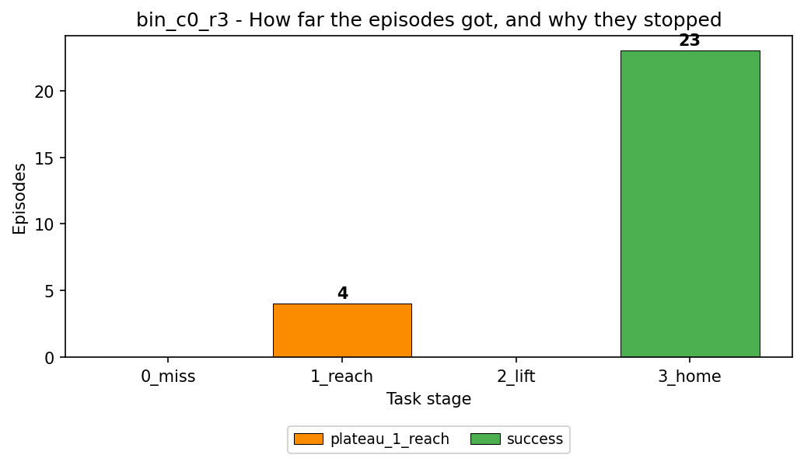
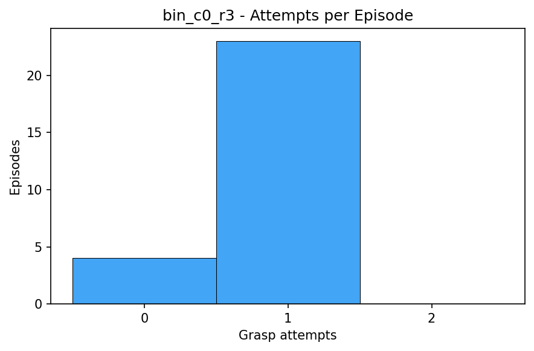
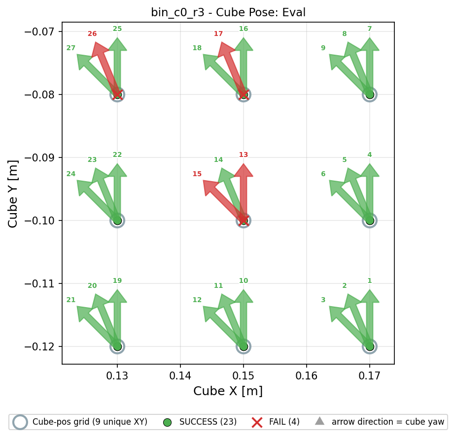
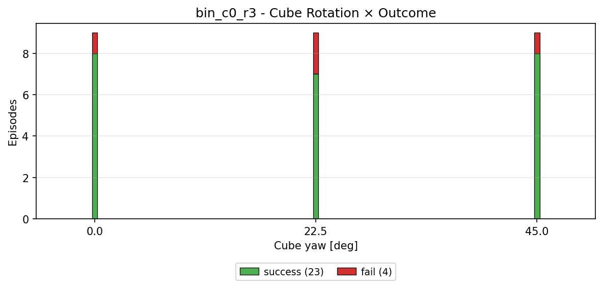
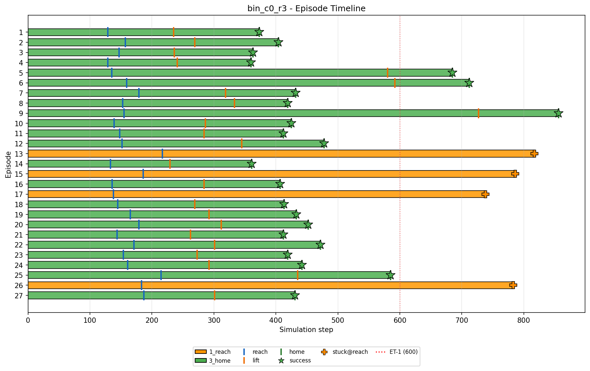
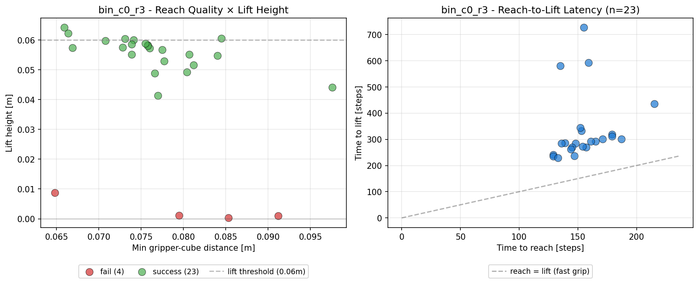
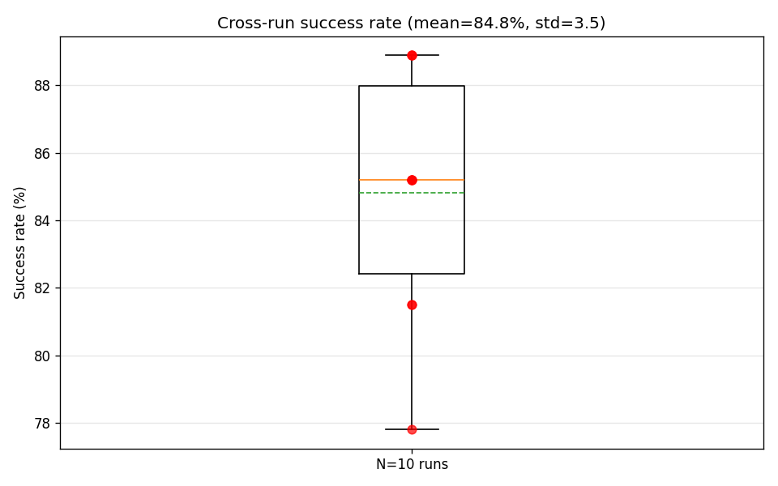
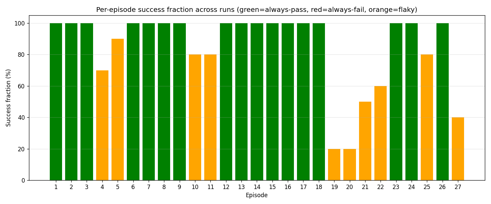
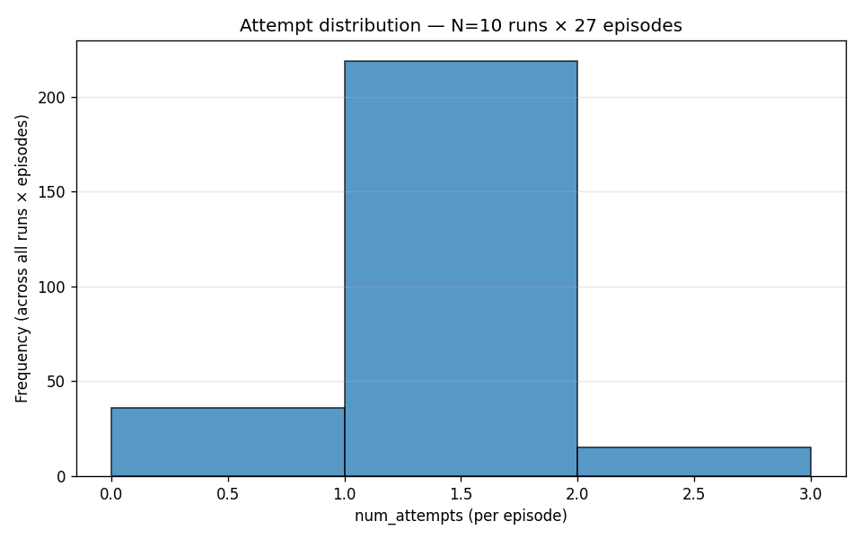
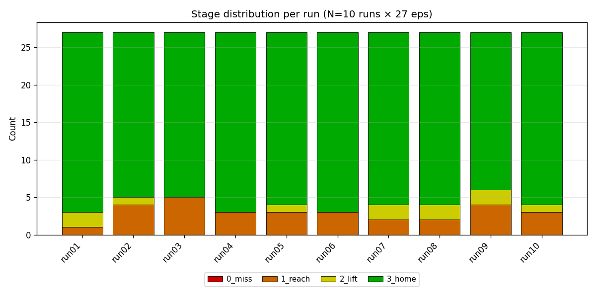

# Stage 5 — Reporting

Turn the evaluation output into plots and written summaries. This stage needs
no GPU and no simulator, and you can re-run it as often as you like: it only
reads what stage 4 already wrote.

```{raw} html
<video autoplay loop muted playsinline width="100%" poster="../_static/demo/stage5_reporting.jpg">
  <source src="../_static/demo/stage5_reporting.mp4" type="video/mp4">
</video>
```


## How to use

### 1. Confirm the inputs exist

Both commands read the run's `eval_summary.json` and its
`eval_results_random_*.csv`. `report` additionally picks up `quality_gate.json`
if it is there, and simply omits that section if it is not. Those files only
appear if the evaluation ran with `--full_report`. If they are missing, the
evaluation has to be repeated. Nothing here can reconstruct them.

### 2. Report a single run

```bash
python -m so101_mvbench.evaluation.report \
    --dir outputs/2cam_wrist_front/eval_cylroom_async_bin_c0_r0/run01
```

This writes `<eval_dir>/report/` with `report.md` (plots embedded),
`report.txt` (same content as plain text, for reading over a terminal) and
six plots, plus a seventh when the run has a discoverable
`holdout_episodes.json`:

| Plot | What it answers |
|------|-----------------|
| `stage_outcome.png` | How far did the episodes get, and why did each one stop? |
| `attempts_histogram.png` | How many grasp attempts per episode? |
| `cube_position_analysis.png` | *Where* in the workspace does the policy fail? |
| `cube_rotation_analysis.png` | Does failure correlate with the cube's yaw? |
| `episode_timeline.png` | Where does time go inside an episode? |
| `timing_and_distance.png` | How fast does it reach and lift, how close does the gripper get? |
| `holdout_vs_training_analysis.png` | How do the evaluated positions relate to the trained ones? Written only when a `holdout_episodes.json` is found, skipped otherwise. |

Stage and termination reason used to be two charts, plus a sunburst of the
same numbers. Across 10,800 episodes of the cylinder-room corpus each stage had
exactly one dominant reason, so all three showed the same four values. The only
episodes that broke the pattern, twelve that timed out instead of plateauing,
were invisible in the stage chart. They are a stacked segment now.

Cube yaw comes from `binmap.json`, the same file the simulator reads when
placing the cube, so plot and scene cannot disagree. Its chart draws one slim
bar per angle that actually occurs, not a histogram: the recorded yaws are a
handful of discrete values, and a five-degree bin would show a range that was
never recorded.

In the episode timeline, the bar colour is the highest stage an episode reached,
the `|` marks are reach, lift and home, and the marker at the end says why the
episode stopped. `report.md` spells out every marker that appears in a given
run, so the plot itself stays free of a glossary box.

Lift height in `timing_and_distance.png` is measured relative to where the cube
started: `max_height - initial_cube_z`. In the cylinder-room scene the absolute
world Z of every cube sits near the table height, which would clump all points
into one band.

### 3. Aggregate the repeats

A campaign runs each policy-and-bin cell several times with the same seed. The
spread across those repeats is the noise floor of the measurement, so a single
run is never the answer:

```bash
python -m so101_mvbench.evaluation.aggregate_report \
    --run_dirs outputs/2cam_wrist_front/eval_cylroom_async_bin_c0_r0/run* \
    --output_dir outputs/2cam_wrist_front/eval_cylroom_async_bin_c0_r0/aggregate
```

This writes `aggregate_report.md`, `aggregate_report.txt`,
`aggregate_summary.json` and four plots under `plots/`:

| Plot | What it answers |
|------|-----------------|
| `cross_run_success_rate.png` | How stable is the success rate across repeats? |
| `per_episode_success.png` | Which individual episodes are flaky? |
| `cross_run_attempts.png` | Does the number of attempts vary between repeats? |
| `cross_run_stage_distribution.png` | Did the failure mode shift in some repeat? |

### 4. Read the numbers honestly

- Report the mean **with** the spread. A difference between two camera sets
  that is smaller than the cross-run spread is not a finding.
- Report the conditions next to every number: episode count, which bins,
  which checkpoint step, how many repeats. A success rate without them cannot
  be compared to anything.
- Episodes sitting near 50 % in `per_episode_success.png` are flaky rather
  than failed, and usually sit at the edges of the workspace.

## What the plots look like

```{raw} html
<video autoplay loop muted playsinline width="100%" poster="../_static/demo/eval_and_report.jpg">
  <source src="../_static/demo/eval_and_report.mp4" type="video/mp4">
</video>
```

Left, one policy failing and then succeeding. Right, the report for that same
bin.

From one development run, as a format reference. Your numbers will differ.





















## Where to go next

- {doc}`04_evaluation` — produces the input files
- `evaluation/METRICS.md` in the repository — what every CSV column means
